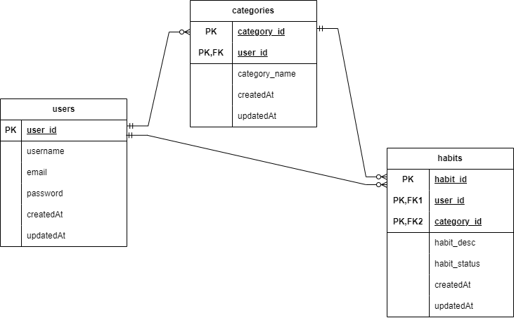

# 1. Database Creation
* There will be 3 tables in the database, namely 'users', 'categories' and 'habits'

* A user can create zero or more category. Each category belongs to exactly one user, and this is established through a foreign key relationship (user_id) in the categories table, referencing the user_id in the users table. This defines a one-to-many relationship from users to categories. 
* A user can have zero or more habits. Each habit is associated with exactly one user, as indicated by the user_id in the habits table, which references the user_id in the users table. This creates a one-to-many relationship from users to habits.
* A category can contain zero or more habit. Each habit belongs to a specific category, indicated by the category_id in the habits table, referencing the category_id in the categories table. This forms another one-to-many relationship from categories to habits.
* The habits table has two foreign keys (user_id and category_id) that together ensure each habit is associated with both a specific user and a specific category.

**a. users table**
* The table contains attributes such as user_id, username, email and password. createdAt and updatedAt are 
automatically created by Sequelize. The primary key of 'users' table is user_id

* Files involved: `user.model.js`, `user.controller.js`, `users.routes.js`

**b. categories table**
* The table contains attributes such as category_id, category_name and user_id. The primary key is category_id 
whereas the user_id acts as the foreign key

* Files involved: `category.model.js`, `category.controller.js`, `categories.routes.js`

**c. habits table**
* The table contains attributes such as habit_id, habit_desc, habit_status, category_id and user_id. The primary key 
is habit_id whereas the user_id and category_id act as the foreign keys

* Files involved: `habit.model.js`, `habit.controller.js`, `habits.routes.js`

# 2. API Implementation

**a. Create user**
* Command: http POST http://localhost/api/users username='Serena03' email='serena@gmail.com' password='hello2003'
* A new user with username "Serena03", email 'serena@gmail.com', password 'hello2003' is created

* For better illustration purposes in c and d, another 2 new users are created

**b. Update user**
* Command: http PUT http://localhost/api/users/1 username='Serena' password='hello2024'
* Changes are made in the user information with user_id = 1, the username is updated from 'Serena03' to 'Serena' and the password is updated from 'hello2003' to 'hello2024'

* Ensure the changes made is updated by retrieveing the user with user_id 1:

**c. Get user**
* Command: http GET http://localhost/api/users
* Retrieves all users

**d. Delete user**
* Command: http DELETE http://localhost/api/users/2
* The user with user_id 2 is deleted

* Only users with user_id 1 and 3 are in the retrieval output, user with user_id 2 has been successfully deleted

**e. Create category**
* Command: http POST http://localhost/api/users/1/categories category_name='Fitness'
* A new category with category_name 'Fitness' is created

* For better illustration purposes in g and h, another 2 new categories are created

**f. Update category**
* Command: http PUT http://localhost/api/users/1/categories/1 category_name='Body fitness'
* In category with category_id 1, the category_name is updated from 'Fitness' to 'Body fitness'

**g. Get category**
* Command: http GET http://localhost/api/users/1/categories
* Retrieve all categories associated with user_id 1

**h. Delete category**
* Command: http DELETE http://localhost/api/users/1/categories/3
* The category with category_id 3 is deleted successfully

* To confirm the category with category_id 3 is deleted:

**i. Create habit**
* Command: http POST http://localhost/api/users/1/categories/1/habits habit_desc='Jog 30 minutes'
* Create a new habit with description 'Jog 30 minutes'

* For better illustration purposes in k and l, another 2 new habits are created

**j. Update habit**
* Command: http PUT http://localhost/api/users/1/categories/1/habits/1 habit_desc='Jog 30 minutes in morning'
* In habit with habit_id 1 associated with user_id 1 and category_id 1, habit description is updated from 'Jog 30 minutes' to 'Jog 30 minutes in morning'

**k. Get habit**
* Command: http GET http://localhost/api/users/1/categories/1/habits
* Retrieves all habits associated with user_id 1 and category_id 1

**l. Delete habit**
* Command: http DELETE http://localhost/api/users/1/categories/1/habits/3
* Habit with habit_id 3 is deleted

* To confirm habit with habit_id 3 is deleted:

# 3. Frontend Implementation

**a. Landing Page**

